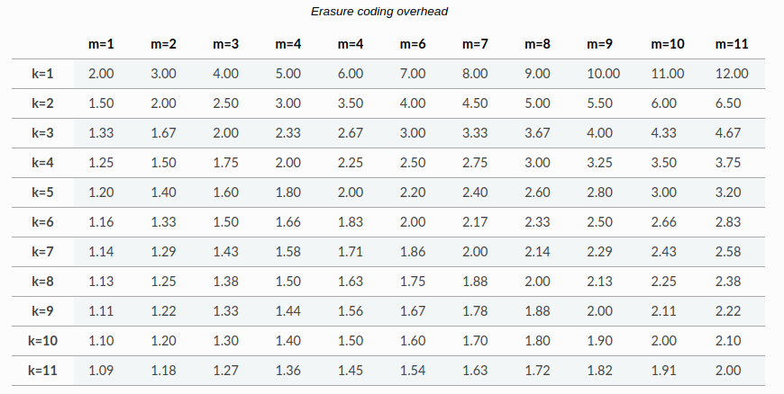

# Config files for create Storageclass

**Note: Not recommend for using Storageclass-1replica.yaml**

### Erasure Coding

- An erasure coded pool stores each object as `K+M` chunks. It is divided into `K` data chunks and `M` coding chunks.

**K:** The number of data chunks

**M:** The number of coding chunks

**The formula to calculate the overhead is:**

    nOSD * k / (k+m) * OSD Size

